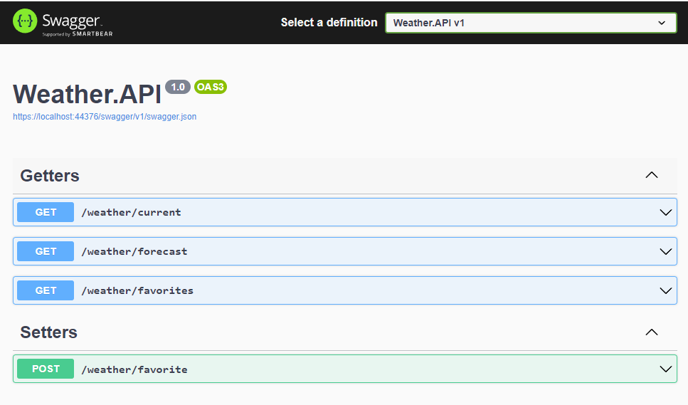

 
 
 # Clean Architecture WeatherApi
[](https://github.com/Gramli/WeatherApi/actions/workflows/dotnet.yml)
[](https://www.codacy.com/gh/Gramli/WeatherApi/dashboard?utm_source=github.com&amp;utm_medium=referral&amp;utm_content=Gramli/WeatherApi&amp;utm_campaign=Badge_Grade)
[](https://www.codacy.com/gh/Gramli/WeatherApi/dashboard?utm_source=github.com&utm_medium=referral&utm_content=Gramli/WeatherApi&utm_campaign=Badge_Coverage)

REST API solution demonstrates how to create clean and modern API (from my point of view) with Clean Architecture, minimal API and various of design patterns.  

Example API allows to get actual/forecast weather data by location from [Weatherbit](https://www.weatherbit.io/) throught [RapidAPI](https://rapidapi.com) and also allow's to add favorite locations into [in memory database](https://learn.microsoft.com/en-us/ef/core/providers/in-memory/?tabs=dotnet-core-cli) and then get weather data by stored (favorites) locations.

## Menu
* [Get Started](#get-started)
* [Motivation](#motivation)
* [Architecture](#architecture)
	* [Minimal API](#minimal-api)
		* [Pros](#pros)
		* [Cons](#cons)
	* [Benefits of Clean Architecture](#benefits-of-clean-architecture)
	* [Clean Architecture Layers](#clean-architecture-layers)
		* [Horizontal Diagram (references)](#horizontal-diagram-references)
* [Technologies](#technologies)


## Get Started
1. Register on [RapidAPI](https://rapidapi.com)
2. Subscribe Weatherbit (its for free) and go to API Documentation
3. In API documentation copy (from Code Snippet) **X-RapidAPI-Key**, **X-RapidAPI-Host** and put them to appsettings.json file in WeatherAPI project
```json
  "Weatherbit": {
    "BaseUrl": "https://weatherbit-v1-mashape.p.rapidapi.com",
    "XRapidAPIKey": "value from code snippet",
    "XRapidAPIHost": "value from code snippet"
  }
```
4. Run & Try it in SwaggerUI


## Motivation
Main motivation is to write practical example of minimal API, to see it's benefits and disadvantages. Also to create REST API example project using Clean Architecture and design patterns.
## Architecture

Projects folows **[Clean Architecture](https://learn.microsoft.com/en-us/dotnet/architecture/modern-web-apps-azure/common-web-application-architectures#clean-architecture)**, but application layer is splitted to Core and Domain projects where Core project holds business rules and Domain project contains business entities.

As Minimal API allows to inject handlers into endpoint map methods, I decided to do not use **[MediatR](https://github.com/jbogard/MediatR)**, but still every endpoint has its own request and handler. Solution folows **[CQRS pattern](https://learn.microsoft.com/en-us/azure/architecture/patterns/cqrs)**, it means that handlers are separated by commands and queries, command handlers handle command requests and query handlers handle query requests. Also repositories (**[Repository pattern](https://learn.microsoft.com/en-us/aspnet/mvc/overview/older-versions/getting-started-with-ef-5-using-mvc-4/implementing-the-repository-and-unit-of-work-patterns-in-an-asp-net-mvc-application)**) are separated by command and queries.

Instead of throwing exceptions, project use **[Result pattern](https://www.forevolve.com/en/articles/2018/03/19/operation-result/)** (using [FluentResuls package](https://github.com/altmann/FluentResults)) and for returning exact http response, every handler returns data wraped into HttpDataResponse object which contains also error messages collection and http response code.

Important part of every project are **[tests](https://github.com/Gramli/WeatherApi/tree/main/src/Tests)**. When writing tests we want to achieve [optimal code coverage](https://stackoverflow.com/questions/90002/what-is-a-reasonable-code-coverage-for-unit-tests-and-why). I think that every project has its own optimal code coverage number by it's need and I always follow the rule: cover your code to be able refactor without worry about functionality change.

In this solution, each 'code' project has its own unit test project and every **unit test** project copy the same directory structure as 'code' project, which is very helpful for orientation in test project.

### Minimal API
#### Pros
- **Reduce the ceremony of creating APIs**
	- no controllers (but you are still able to organize map methods in files)
	- injects bussines handlers directly into endpoints map methods
- **Minimal Hosting Model**
	- you are able to create single clean start point of the API
#### Cons
- **Complex Query Parameters (ASP.NET Core 6.0)**
	- **ASP.NET Core 6.0** does not support complex query parameters, you have to write [Custom Binding](https://learn.microsoft.com/en-us/aspnet/core/fundamentals/minimal-apis?view=aspnetcore-6.0#custom-binding), anyway **ASP.NET Core 7.0** contains binding support using **[AsParameters]** attribute.
### Benefits of Clean Architecture
- **UI/Framework/Database Independent** 
	- easily change framework/database without touching internal layers
	- UI is top layer so you are able to change it without touching any internal layer
- **Highly Testable** - clean architechture is designed for testing, so you can for example easily test business logic without touching any external element like database, UI, external web service etc.

### Clean Architecture Layers

Solution contains four layers: 
* **WeatherAPI** - entry point of the application, top layer
	*  Endpoints
	*  Middlewares (or Filters)
	*  API Configuration
* **Weather.Infrastructure** - layer for communication with external resources like database, cache, web service.. 
	*  Repositories Implementation - access to database
	*  External Services Proxies - proxy classes implementation - to obtain data from external web services
	*  Infastructure Specific Services - services which are needed to interact with external libraries and frameworks
	* **Weatherbit.Client** - standalone project for communication with RapidAPI/Weatherbit
* **Weather.Core** - business logic of the application
	*  Request Handlers/Managers/.. - business implementation
	*  Abstractions - besides abstractions for business logic are there abstractions for Infrastructure layer (Service, Repository, ..) to be able use them in this (core) layer
* **Weather.Domain** - all what should be shared across all projects
	* DTOs
	* General Extensions

#### Horizontal Diagram (references)


## Technologies
* [ASP.NET Core 7](https://learn.microsoft.com/en-us/aspnet/core/introduction-to-aspnet-core?view=aspnetcore-7.0)
* [Entity Framework Core InMemory](https://learn.microsoft.com/en-us/ef/core/providers/in-memory/?tabs=dotnet-core-cli)
* [AutoMapper](https://github.com/AutoMapper/AutoMapper)
* [FluentResuls](https://github.com/altmann/FluentResults)
* [Validot](https://github.com/bartoszlenar/Validot)
* [GuardClauses](https://github.com/ardalis/GuardClauses)
* [Moq](https://github.com/moq/moq4)
* [Xunit](https://github.com/xunit/xunit)


