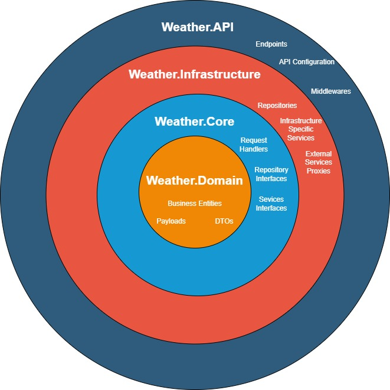

#IN PROGRESS
# WeatherApi
C# REST API solution showing practical example of Clean Architecture, minimal API and CQRS, Repository patterns. 

### Layers

Solution contains four layers: 
* **WeatherAPI** - entry point of the application
	*  Endpoints
	*  Middlewares (or Filters)
	*  API Configuration
* **Weather.Infrastructure** - in most data access implementations
	*  Repositories Implementation - access to database
	*  External Services Proxies - proxy classes implementation to obtain data from external services)
	*  Infastructure Specific Services - services which are needed to interact with infrastructure
* **Weather.Core** - business logic implementatin of the application
	*  Request Handlers - business implementation
	*  Interfaces - interfaces for Infrastructure layer (Service, Repository, ..)
* **Weather.Domain** - POCO classes, extensions, all what needs solution projects
	* Business Entities
	* DTOs
	* Payloads
	* General Extensions

#### Onion Diagram

#### Horizontal Diagram (references)

